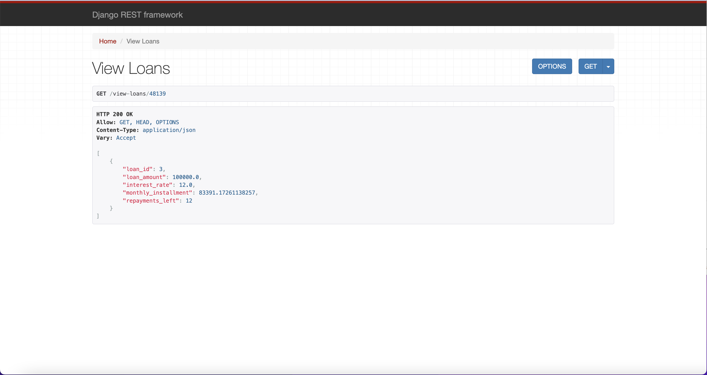
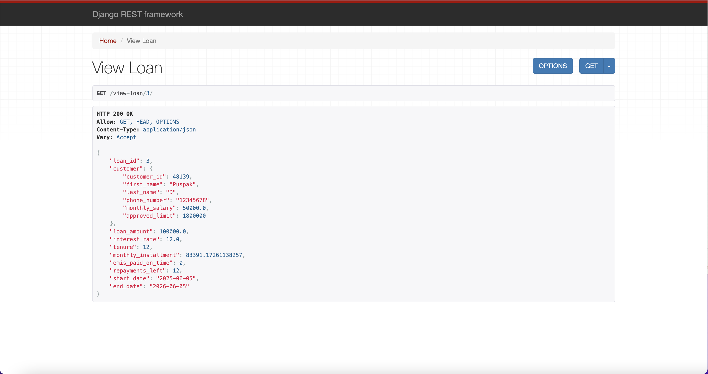
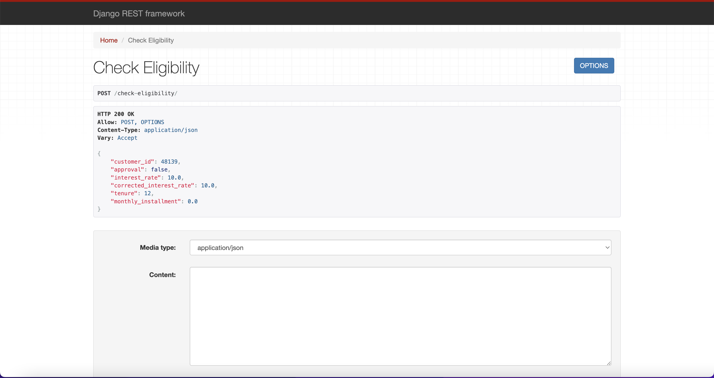

# Credit Approval System

A modern Django-based credit approval system that helps financial institutions evaluate loan applications efficiently.

## 🚀 Features

- Customer registration and management
- Automated loan eligibility checking
- Credit score calculation
- Loan application processing
- Real-time loan status tracking
- RESTful API architecture

## 🛠️ Tech Stack

- Python 3.11+
- Django 5.0
- Django REST Framework
- PostgreSQL
- Docker & Docker Compose
- Celery for async tasks
- Redis for caching

## 📋 Prerequisites

- Docker and Docker Compose
- Python 3.11 or higher
- PostgreSQL 15+

## 🚀 Setup and Installation

### Option 1: Using Docker (Recommended)

The easiest way to run the project is using Docker Compose, which will automatically set up all required services (Django, PostgreSQL, Redis, Celery) and handle the configuration.

1. Clone the repository:
```bash
git clone https://github.com/your-username/credit-approval-system.git
cd credit-approval-system
```

2. Set up environment variables:
```bash
cp .env.example .env
```
Edit the `.env` file with your configuration:
```
SECRET_KEY=your-secret-key
DEBUG=True
DB_NAME=credit_db
DB_USER=postgres
DB_PASSWORD=your-password
DB_HOST=db
DB_PORT=5432
```

3. Build and start all services with a single command:
```bash
docker-compose up --build
```
This command will:
- Build all Docker images
- Set up the PostgreSQL database
- Configure Redis for caching
- Start the Django application
- Start the Celery worker
- Run all necessary migrations
- Set up all required dependencies

The application will be available at `http://localhost:8000`

To run in detached mode (in the background):
```bash
docker-compose up --build -d
```

To view logs:
```bash
docker-compose logs -f
```

To stop all services:
```bash
docker-compose down
```

### Option 2: Local Development Setup

1. Create and activate a virtual environment:
```bash
python -m venv venv
source venv/bin/activate  # On Windows: venv\Scripts\activate
```

2. Install dependencies:
```bash
pip install -r requirements.txt
```

3. Set up environment variables (same as Docker setup)

4. Run migrations:
```bash
python manage.py migrate
```

5. Start the development server:
```bash
python manage.py runserver
```

6. Start Celery worker (in a new terminal):
```bash
celery -A credit_approval_system worker -l info
```

## 🏃‍♂️ Running the Application

### API Endpoints

1. **Customer Registration**
```bash
POST /api/customers/register/
```

2. **Check Loan Eligibility**
```bash
POST /api/loans/check-eligibility/
```

3. **Create Loan Application**
```bash
POST /api/loans/create/
```

4. **View Loans**
```bash
GET /api/loans/
```

## 🎥 Demo Video

You can watch a demo of the Credit Approval System in action:

- [Watch on Google Drive](https://drive.google.com/file/d/1cYZm4-XokozAWfZwgVoSnk34MBDlNIzU/view?usp=sharing)

Below is an embedded video player (works on GitHub if the video is uploaded to the repo):

```html
<video src="https://drive.google.com/uc?export=download&id=1cYZm4-XokozAWfZwgVoSnk34MBDlNIzU" controls width="600"></video>
```

> If the embedded player does not work, please use the Google Drive link above to view the demo.

## 📸 API Screenshots & Examples

Below are some example screenshots from the Django REST Framework API for this project, with brief explanations:

### 1. Check Loan Eligibility

*This screenshot shows the API endpoint for checking a customer's loan eligibility. The response includes approval status, interest rate, tenure, and calculated monthly installment.*

### 2. View Loan Details

*This screenshot displays the details of a specific loan, including customer information, loan amount, interest rate, tenure, and repayment schedule.*

### 3. View All Loans for a Customer

*This screenshot lists all loans associated with a particular customer, showing loan amount, interest rate, monthly installment, and repayments left.*

## 📚 API Documentation

Detailed API documentation is available in the `README_API_TESTING.txt` file.

## 🧪 Testing

Run the test suite:
```bash
# Using Docker
docker-compose exec web python manage.py test

# Local setup
python manage.py test
```

## 🔧 Troubleshooting

1. **Database Connection Issues**
   - Check if PostgreSQL is running
   - Verify database credentials in `.env`
   - Ensure database exists

2. **Celery Worker Issues**
   - Check Redis connection
   - Verify Celery configuration in `settings.py`
   - Check worker logs

3. **Docker Issues**
   - Ensure Docker daemon is running
   - Check container logs: `docker-compose logs`
   - Rebuild containers if needed: `docker-compose up -d --build`

## 📝 License

This project is licensed under the MIT License - see the LICENSE file for details.

## 👥 Contributing

Contributions are welcome! Please feel free to submit a Pull Request.

## 📞 Support

For support, please open an issue in the GitHub repository.

---
*Last updated: March 2024*
